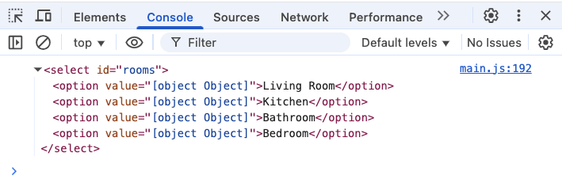
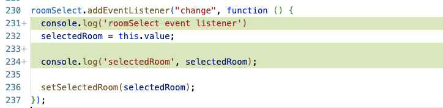
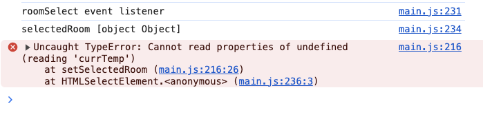

# 🐛 Bugs Documentation
Below are the list of bugs or issues identified within the **Smart Thermostat** app

## Table of Contents

- [Bug 1: Selected dropdown option does not display the correct room and its associated data](#bug-1-selected-dropdown-option-does-not-display-the-correct-room-and-its-associated-data)


## Bug 1: Selected dropdown option does not display the correct room and its associated data

**1. Title**

_Selecting a room from the dropdown menu does not update the UI with the right data_

**2. Bug Description**

When the select dropdown is clicked and an option is selected from the dropdown let's say **Kitchen**;

**_I expect_**:

- the details in the left section **container** to be updated with the details of the selected room(**Kitchen**).

**_What actually happened_**:

- When a room is selected, no action is performed in updating the UI.

**3. Steps to Reproduce**

1. In the left container section, go to the left top corner with the text "Living Room" and **click**.
2. A dropdown menu will appear, **select** a room
3. Notice that after clicking a room, nothing happens(no UI updates occur).

**4. Screenshots / Console Logs**

- console log `roomSelect` variable


- console log `selectedRoom` variable


- console log result of `selectedRoom` variable and **change event listener**


**5. Environment Details**

- Browser: Chrome
- Browser Version: 135.0.7049.115 (Official Build) (x86_64)
- OS: macOS Sonoma 14.5

**6. Debugging Process**

I used the `console.log()` method to help me print out some values in my browser(Chrome) developer console.

- added a `console.log(roomSelect)` after **line `191`** to confirm that the roomSelect variable is defined. And yes, it was. This returned the select element together with their options. I noticed the **value** of the option was `value="[object object]"`

- added a few `console.log()` statements within the event listener callback function to confirm if:
1. the **change event** is being called on `roomSelect` on **line `231`** by adding a `console.log('roomSelect event listener')`.
2. logged the value of `selectedRoom`(**line `232`**) on **line `234`** `console.log('selectedRoom', selectedRoom);` and realized `selectedRoom` is of value **[object object]** and `room.currTemp` property is undefined on **line `216`**

**7. Root Cause**

The root cause of this bug is that, the element `option` value is set to an **object** which is wrong. The element option value only accepts a **string** as a value.

**8. Fix Summary**

Set the `option.value` properly to a string (the room name)

```js
option.value = room.name;

// not: option.value = room;
```

**9. Status**

- ✅ Fixed
