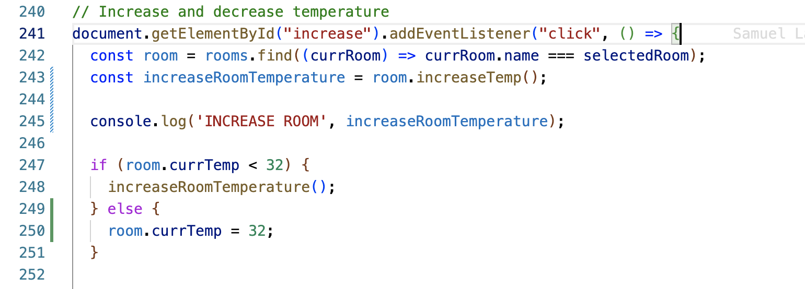
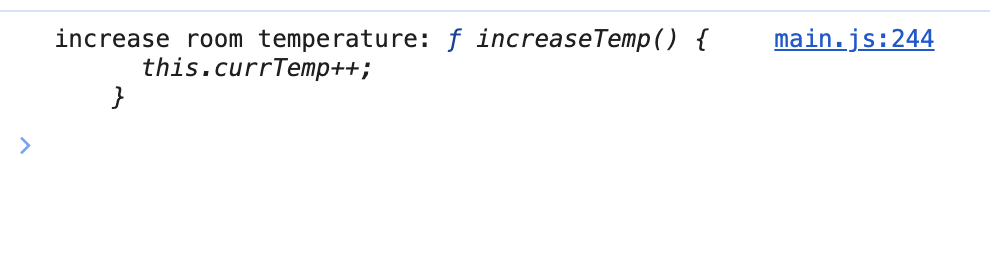
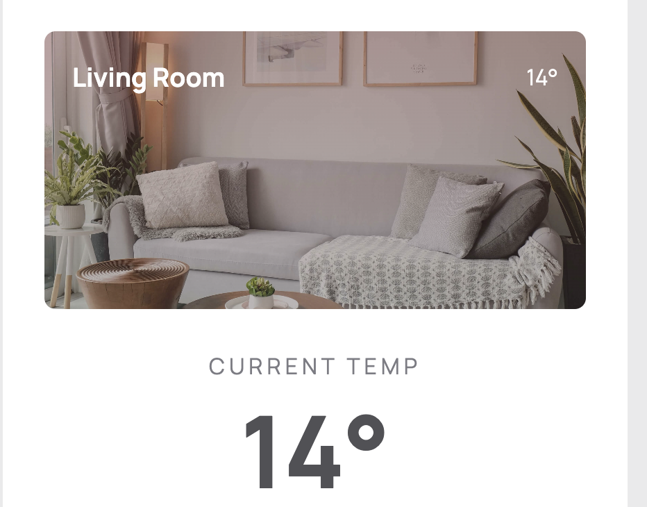
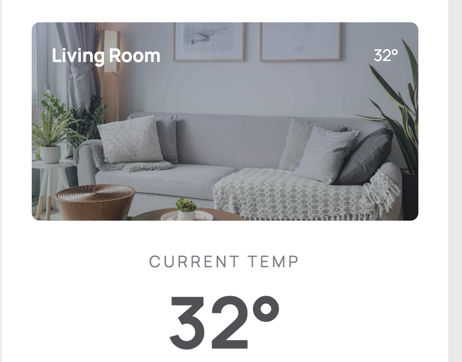

# 🐛 Bugs Documentation

Below are the list of bugs or issues identified within the **Smart Thermostat** app

## Table of Contents

- [Bug 1: Selected dropdown option does not display the correct room and its associated data](#bug-1-selected-dropdown-option-does-not-display-the-correct-room-and-its-associated-data)

- [Bug 2: Increase and Decrease buttons do not reduce or increase room temperature](#bug-2-increase-and-decrease-buttons-do-not-reduce-or-increase-room-temperature)

## Bug 1: Selected dropdown option does not display the correct room and its associated data

**1. Title**

_Selecting a room from the dropdown menu does not update the UI with the right data_

**2. Bug Description**

When the select dropdown is clicked and an option is selected from the dropdown let's say **Kitchen**;

**_I expect_**:

- the details in the left section **container** to be updated with the details of the selected room(**Kitchen**).

**_What actually happened_**:

- When a room is selected, no action is performed in updating the UI.

**3. Steps to Reproduce**

1. In the left container section, go to the left top corner with the text "Living Room" and **click**.
2. A dropdown menu will appear, **select** a room
3. Notice that after clicking a room, nothing happens(no UI updates occur).

**4. Screenshots / Console Logs**

- console log `roomSelect` variable
  

- console log `selectedRoom` variable
  

- console log result of `selectedRoom` variable and **change event listener**
  

**5. Environment Details**

- Browser: Chrome
- Browser Version: 135.0.7049.115 (Official Build) (x86_64)
- OS: macOS Sonoma 14.5

**6. Debugging Process**

I used the `console.log()` method to help me print out some values in my browser(Chrome) developer console.

- added a `console.log(roomSelect)` after **line `191`** to confirm that the roomSelect variable is defined. And yes, it was. This returned the select element together with their options. I noticed the **value** of the option was `value="[object object]"`

- added a few `console.log()` statements within the event listener callback function to confirm if:

1. the **change event** is being called on `roomSelect` on **line `231`** by adding a `console.log('roomSelect event listener')`.
2. logged the value of `selectedRoom`(**line `232`**) on **line `234`** `console.log('selectedRoom', selectedRoom);` and realized `selectedRoom` is of value **[object object]** and `room.currTemp` property is undefined on **line `216`**

**7. Root Cause**

The root cause of this bug is that, the element `option` value is set to an **object** which is wrong. The element option value only accepts a **string** as a value. This was causing the `room` variable within the `setSelectedRoom` function to be **undefined** because the find method on the `rooms` variable **returns undefined** when no match is found.

**8. Fix Summary**

Set the `option.value` properly to a string (the room name)

```js
option.value = room.name;

// not: option.value = room;
```

**9. Status**

- ✅ Fixed

## Bug 2: Increase and Decrease buttons do not reduce or increase room temperature

**1. Title**

Increase and Decrease temperature buttons not working

**2. Bug Description**

When a user clicks on the "+" button, the temperature value does not change. The same goes with the "-" button as well.

**_I expect_**:

- the temperature value for a room to change when the "+" button is clicked up till the point where the temperature is 32 degress. Also when the "-" decrease button is clicked,the temperature value for the room should change till it is not less than 10.

**_What actually happened_**:

- when the buttons are clicked the temparture value should change accordinly.

**3. Steps to Reproduce**

1. Click on the increase or decrease button in the left container
2. Notice that, the temperature value for the selected room remains the same

**4. Screenshots / Console Logs**

- console log `increaseRoomTemperature` variable
  

- `increaseRoomTemperature`results in dev console
  

**5. Environment Details**

- Browser: Chrome
- Browser Version: 135.0.7049.115 (Official Build) (x86_64)
- OS: macOS Sonoma 14.5

**6. Debugging Process**

- added a `console.log()` after **line `243`** to know the value of `increaseRoomTemperature`. I realised that, `room.increaseTemp` was being passed to `increaseRoomTemperature` variable as a reference. And eventhough the `increaseRoomTemperature()` is called later, the **this** in the `increaseTemp()` on the room object is no longer refering to the room object, but rather refering to the global object and this causes `this.currTemp++` not to update.

- deleted the original code on line 243: `const increaseRoomTemperature = room.increaseTemp;` and replaced `increaseRoomTemperature();` with `room.increaseTemp()` in the if block

- added an else block to prevent temperature from exceeding 32 by resetting `room.currTemp = 32;`

**NB**: _I applied the same debugging process to the decrease temperature functionality as well_

**7. Root Cause**

The root cause is that room.increaseTemp() was not called but rather passed to a variable as a reference to be called later thereby making the this keyword to reference the global object and not the room object.

**8. Fix Summary**

- Call the room.increaseTemp() directly
- Bind room.increaseTemp to the room object. With this references the room object and not the global object.

```js
// solution 1:
room.increaseTemp();

// solution2:
room.increaseTemp.bind(room);
```

**9. Status**

- ✅ Fixed

## Bug 3: The visual communication for warm and cool overlay is improperly represented

**1. Title**

The visual communication for warm and cool overlay is improperly represented

**2. Bug Description**

Overlay color for representing cold and warm temperatures was not shown properly

**_I expect_**:

- temperature values from 10 to 24 to show a cool overlay color(a shade of light blue) whiles temperature values from 25 to 32 show a warm overlay color(a shade of light red)

**_What actually happened_**:

- temperature values from 10 to 24 shows a warm color overlay instead of cool and vice versa.

**3. Steps to Reproduce**

1. to show a warm overlay, decrease temperature to fall below 25 degrees celcius
2. to show a cool overlay, increase temperature so that the value is above 24 degrees celcuis

**4. Screenshots / Console Logs**

- cool temperature showing warm overlay
  

- warm temperature showing cool overlay
  

**5. Environment Details**

- Browser: Chrome
- Browser Version: 135.0.7049.115 (Official Build) (x86_64)
- OS: macOS Sonoma 14.5

**6. Debugging Process**

- used the developer console inspect tool to check the overlay color value for a particular room temperature.
- I then noticed that the color value for the overlay wasn't correct
- To resolve the issue, I interchanged the color values assigned to the varialbes `warmOverlay` and `coolOverlay`

**7. Root Cause**

Color values assigned to variables `warmOverlay` and `coolOverlay` were interchanged

**8. Fix Summary**

```js
const coolOverlay = `linear-gradient(
    to bottom,
    rgba(141, 158, 247, 0.2),
    rgba(194, 197, 215, 0.1)
  )`;

const warmOverlay = `linear-gradient(to bottom, rgba(236, 96, 98, 0.2), rgba(248, 210, 211, 0.13))`;
```

**9. Status**

- ✅ Fixed
